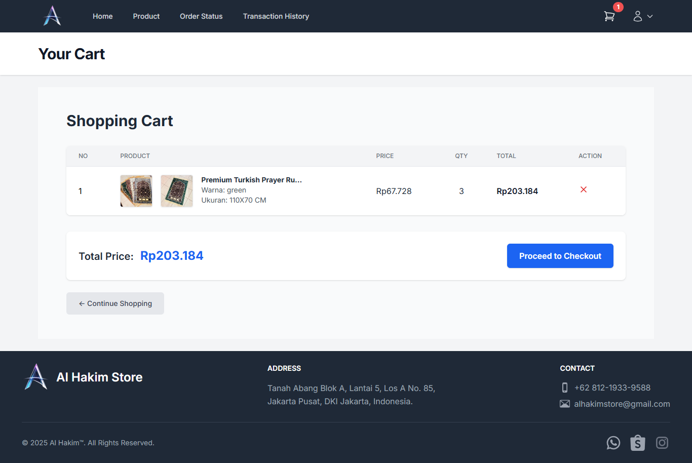

# 🛍️ Al-Hakim Store Web-Based Sales System

This project is a **web-based sales system** developed as part of an undergraduate thesis:

> _"Development of Al-Hakim Store Sales System Based on Web with Midtrans Payment Gateway Integration and Customer Relationship Management (CRM) Approach"_  
> by **Muhammad Daffa Al Hakim**.

---

## 🚀 Tech Stack

-   **Framework**: Laravel 11 (PHP)
-   **Frontend**: Blade Template, Tailwind CSS, Alpine.js
-   **Database**: MySQL
-   **Local Development**: Laragon, phpMyAdmin
-   **Payment Gateway**: Midtrans
-   **Shipping API**: RajaOngkir (domestic)
-   **CRM Integration**: Email & WhatsApp (via Fonnte API)
-   **Additional Libraries**: SweetAlert, Trix Editor, dompdf

---

## 📌 Key Features

### 🔹 User

-   User registration, login, and profile management (edit, reset password).
-   Product catalog with search, product details, variants (color/size), stock & rating.
-   Shopping cart with automatic price calculation.
-   Checkout with shipping cost integration (RajaOngkir).
-   Online payment via Midtrans.
-   Order tracking and transaction history.
-   Product reviews and ratings.
-   Receive promotions via email & WhatsApp.

### 🔹 Admin

-   Dashboard with sales, orders, and users overview.
-   CRUD Products & variants.
-   Manage homepage hero section.
-   Manage orders & update shipping status.
-   User management.
-   Manage product reviews & ratings.
-   Sales reports (PDF).
-   CRM: send promotions via email & WhatsApp.

---

## 🗄️ Database Structure (Simplified)

-   `users` – user/admin accounts
-   `products`, `product_variants` – products and variants
-   `carts`, `cart_items` – shopping cart data
-   `orders`, `order_items` – order transactions
-   `ratings` – product reviews
-   `promotions` – promotion campaigns
-   `banners` – homepage hero section

---

## ⚙️ Installation & Setup

1. Clone repository:
    ```bash
    git clone https://github.com/username/repository-name.git
    cd repository-name
    ```
2. Install dependencies:
   composer install
   npm install

3. Configure environment:
   cp .env.example .env
   Edit .env file to configure database & API (Midtrans, RajaOngkir, Fonnte).

4. Generate application key:
   php artisan key:generate

5. Run migration & seeding:
   php artisan migrate --seed

6. Run Tailwind (Vite) build:
   npm run dev
   (for production use npm run build instead)

7. Start local server:
   php artisan serve

## 🧪 Testing

-   Functional: All features work as expected.
-   Non-Functional: System is stable and responsive.
-   User Feedback (Likert Scale): Average satisfaction above 86% (Strongly Agree).

## 📸 Screenshots

-   Homepage
    

-   Product details
    
    

-   Cart & checkout
    
    

-   Admin dashboard
    
